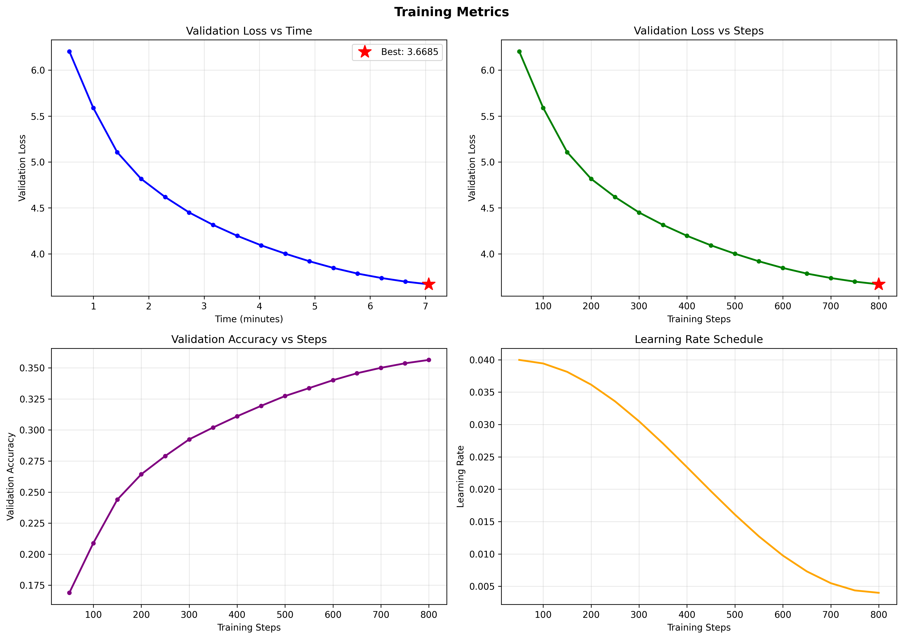

# 5-Dollar LLM (looking for a better name)

> Training the best possible LLM from scratch for $5.

**Open Superintelligence Lab** - Open research for everyone. We publish all of our research for the sake of accelerating science. Learn real AI research from a real research lab.

---

## 🚀 Getting Started

To get started with development, follow these steps to set up your environment.

1. **Fork this repository** - Click the "Fork" button at the top right to create your own copy.
2. **Clone your fork**:
   ```bash
   git clone FORK_URL_HERE
   cd 5-dollar-llm
   ```
   *(You may also clone it with your IDE)*
   
   > **Note:** If you have already forked/cloned, please ensure you sync your fork with this repo & pull the latest changes to your local before starting - we make frequent changes.

3. **Install dependencies**:
   ```bash
   pip install -r requirements.txt
   ```

## ⚡ Quick Start

Once installed, you can train a model using our default configurations.

### Train on Custom Hardware (Recommend 24GB+ VRAM)
To train the main MoE model (configured for a single 24GB GPU like an RTX 3090/4090):

```bash
python train_moe.py
```

### Debugging (Any Hardware)
To quickly check if your code runs without errors on any hardware (including CPU/GPU), use the debug script:

```bash
python debug_moe.py
```
*Runs a `DebugMoEConfig` with a tiny model for 100 steps.*

## 📊 Baselines

We maintain baseline performance metrics to track improvements. All experiments should aim to surpass these benchmarks.

### 24GB GPU Baseline (GPU24GBMoEModelConfig)
*Hardware: Single Nvidia RTX 4090 (24GB)*

> You may train on other hardware.

| Metric | Value |
| :--- | :--- |
| **Validation Loss** | 3.6684 |
| **Validation Accuracy** | 35.64% |
| **Perplexity** | 39.19 |



*Full baseline results are stored in `baselines/gpu_24gb/`.*

## 🧪 Running Experiments

To run a new experiment without overwriting the baseline, simply provide a unique experiment name:

```bash
python train_moe.py --experiment_name my_new_experiment
```

Results (checkpoints and logs) will be saved to `checkpoints/my_new_experiment/` for easy comparison.

> **Performance Test (optional):** We will run the experiments anyways, but you may also run it yourself. Make sure to specify a new name so you don't overwrite the baseline.

## 🤝 Contributing

We welcome all contributions!

### Contribution Workflow

1. **Pick a task**: Check the [Issues](https://github.com/Open-Superintelligence-Lab/5-dollar-llm/issues) tab and carefully read and understand the task.
2. **Write your code**: Fork, clone, and implement your experiment following the setup instructions above.
3. **Verification & Testing**:
   - **Debug Mode:** Run `python debug_moe.py` to quickly verify your code runs without errors.
   - **Performance Test (optional):** Run your experiment with a unique name to test performance.
4. **Submission**: Once finished, create a Pull Request into the `development` branch. Please notify us on [Discord](https://discord.gg/6AbXGpKTwN).

Please read `CONTRIBUTING.md` for detailed guidelines.

### Goals
1. Create a network of contributors and open lab structure to develop state-of-the-art LLMs.
2. Secure compute resources for a larger-scale LLM project to compete with top LLMs.